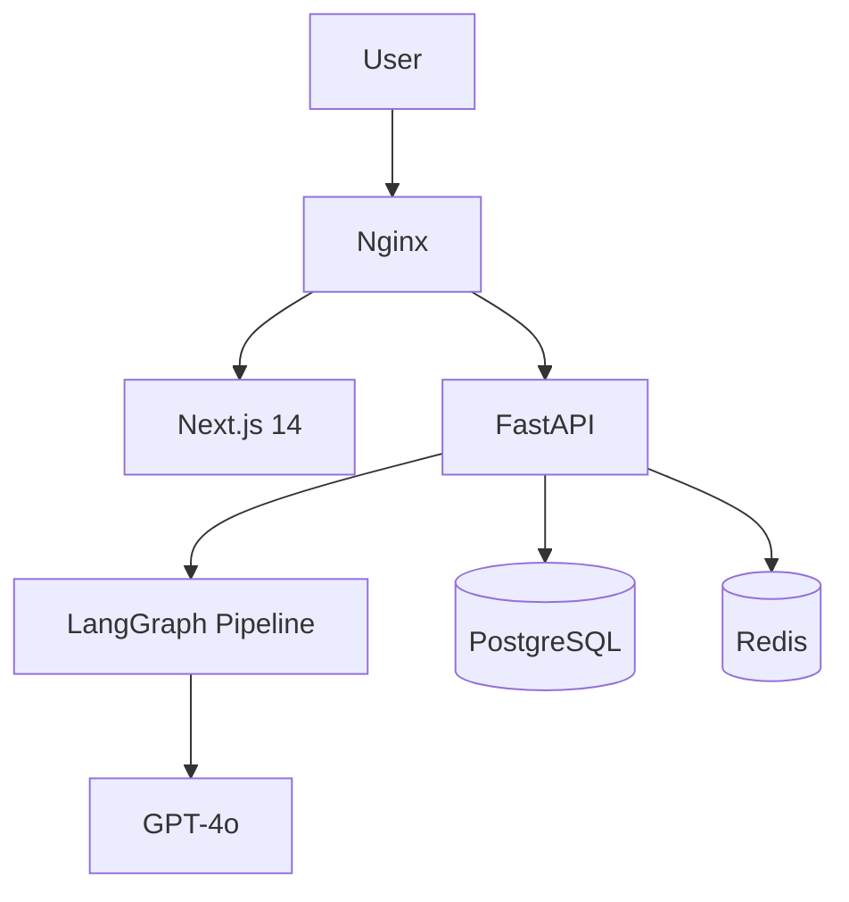

# JD Analyzer — AI 驱动的职位匹配分析工具

基于 LangGraph + GPT-4o，输入 JD 和简历，自动输出匹配分析、面试题预测和定制化自我介绍。

## 技术架构



## 本地开发启动

### 1. 配置环境变量

```bash
cp .env.example .env
# 编辑 .env，填入你的 OPENAI_API_KEY
```

### 2. 一键启动（Docker）

```bash
docker compose up --build
```

访问 http://localhost 即可使用。

### 3. 不用 Docker 的本地开发

**后端：**
```bash
cd backend
pip install -r requirements.txt
alembic upgrade head
uvicorn app.main:app --reload
```

**前端：**
```bash
cd frontend
npm install
npm run dev
```

## 项目结构

```
myproject/
├── backend/           # FastAPI + LangGraph
│   ├── app/
│   │   ├── agents/    # LangGraph 节点
│   │   ├── models/    # SQLAlchemy ORM 模型
│   │   ├── routers/   # API 路由
│   │   └── services/  # 业务逻辑
│   └── tests/
├── frontend/          # Next.js 14 + TypeScript
│   ├── app/           # App Router 页面
│   ├── components/    # UI 组件
│   ├── hooks/         # 自定义 Hooks
│   └── e2e/           # Playwright 测试
├── nginx/
└── docker-compose.yml
```

## 主要功能

- 上传 PDF 简历，粘贴 JD 文本
- AI 解析 JD 必须技能、加分项、文化信号
- 匹配分析：打分 + 优势列表 + Gap 及弥补建议
- 面试题预测：技术深挖 / 项目经历 / Gap 应对
- 定制化自我介绍（中英文）
- 历史记录查询
